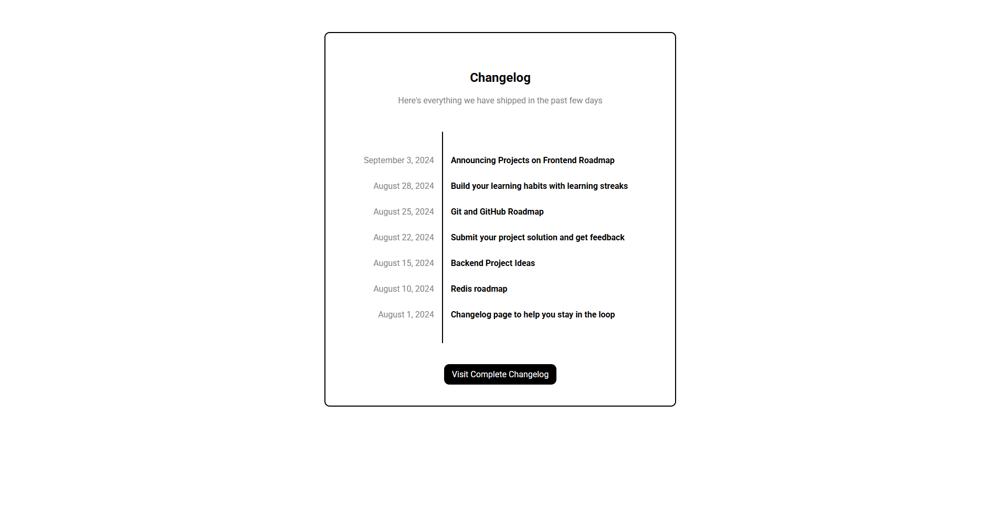

# Changelog Component from Roadmap.sh

<b>Project description:</b> <a href="https://roadmap.sh/projects/changelog-component">Changelog Component</a>

<section>
    <!--<h2>Result</h2>
    -->
</section>
